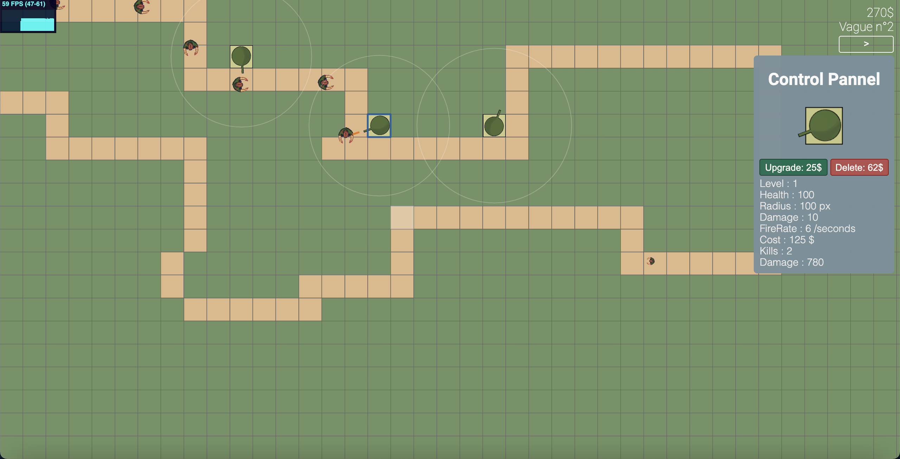

# Tower Defense Game

**[TowerDefenseGame](https://d0rianb.github.io/TowerDefenseGame/) is a tower defense game.**

Written in TypeScript, it can be run in the browser : [at this incredible URL](https://d0rianb.github.io/TowerDefenseGame/).

The game uses the [UnrailEngine](https://github.com/d0rianb/UnrailEngine) with its `Offscreen-Renderer` for the renderering, loop and events managment. It uses `Vue` for the interface.

The game is in an early development state and look like this :

The project can be run with `webpack` installed by the command `npm run dev`.

---

2020 &copy; Dorian Beauchesne
